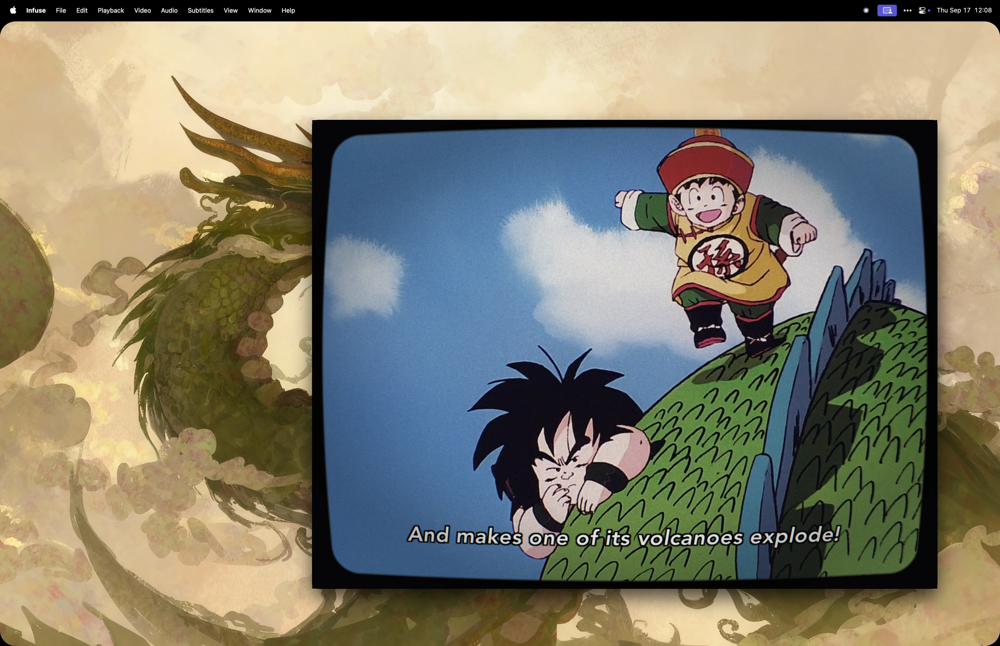

# CRT Lens

Curved glass, phosphor, and glow for the Mac apps you already use. Free and open source under the [MIT license](LICENSE).

I miss the screen as much as the shows and games. CRT Lens puts an ordinary Mac window behind rounded glass, with the texture and depth I remember from old televisions. I use it for watching Dragon Ball Z, playing retro games, and seeing familiar things through a different screen.

[**Download for Mac**](https://github.com/thirdPolarity/window-crt-lens/releases/tag/v0.1.0-preview.2) · [Build from source](#build-from-source)



## Get started

**Apple silicon · macOS 14 or later**

1. Download `CRT-Lens-macOS-AppleSilicon.zip` and unzip it.
2. Move **Window CRT Lens.app** to Applications, then open it.
3. Allow Screen Recording in **System Settings → Privacy & Security** when prompted. Quit and reopen the app after granting access.
4. Choose a visible window and select **Start Lens**.

This preview is not Apple-notarized. If macOS blocks it, follow [Apple's instructions for opening an app you trust](https://support.apple.com/en-us/102445).

Click the **◉** menu bar icon to change the look, adjust the glass, choose another window, or stop the lens. Clicks and typing pass through to the original app. The lens follows its position and size, appears while that app is in the foreground, and can follow it into fullscreen.

## Shape the glass

Seven looks range from subtle curves to bulbous consumer tubes, arcade glass, and an aperture grille. Adjust source zoom, screen corners, outer corners, and edge softness. Each look combines its own scanlines, phosphor pattern, glow, tint, and curvature.

ShaderGlass and Mega Bezel helped shape the idea. My own preference is for rounded corners and a picture with a little volume. Turning up the geometry in Pokémon Silver made familiar paths and buildings feel closer to the place I imagined as a child.

## Privacy and troubleshooting

Screen capture is processed on your Mac. CRT Lens does not save video or send screen content anywhere.

Diagnostic logs stay in `~/Library/Logs/Window CRT Lens/`. They contain app paths and identifiers, window geometry, performance information, and errors, but no screen images, window titles, or typed text. Logs rotate automatically and are never uploaded. Review them before sharing.

- **No windows in the picker:** quit and reopen CRT Lens after granting Screen Recording permission, with the target window visible.
- **A repeating or mirrored picture:** choose **◉ → Diagnostics → Mark Mirror Glitch**, then **Stop Lens**. Quit any duplicate copies of CRT Lens before restarting.
- **Missing or obscured video:** keep the source window visible. Protected video may not be capturable.

The download has been tested on Apple silicon. Intel Macs and multi-display setups have not been tested.

To update, quit CRT Lens before replacing the app. To uninstall, quit and remove it from Applications. You can also remove its diagnostic logs from the folder above.

## Build from source

You need macOS 14 or later and Xcode Command Line Tools with Swift 5.9 or later.

```sh
git clone https://github.com/thirdPolarity/window-crt-lens.git
cd window-crt-lens
swift test
./Scripts/build-app.sh
```

The script creates `dist/Window CRT Lens.app.zip` for your Mac's architecture. Unzip it and move the app to Applications.

CRT Lens uses AppKit, ScreenCaptureKit, and Metal, with no external Swift package dependencies.

## Credits

- [ShaderGlass](https://github.com/mausimus/ShaderGlass) — shaders over everyday app windows.
- [Mega Bezel](https://github.com/HyperspaceMadness/Mega_Bezel) — curved glass, phosphor, and glow.
- [Libretro's CRT shader guide](https://docs.libretro.com/shader/crt/) — CRT rendering references.
- [Drigax's Rooftop Rampage shader](https://github.com/Drigax/RooftopRampage_Source/blob/master/public/Shaders/crt.fragment.fx) — a reference for the Rooftop Arcade look's axis-aware curvature.

The screenshot shows CRT Lens with Infuse. Dragon Ball Z imagery and desktop artwork belong to their respective creators and are not covered by the software license.

## License

[MIT](LICENSE) — free to use, modify, and share.
